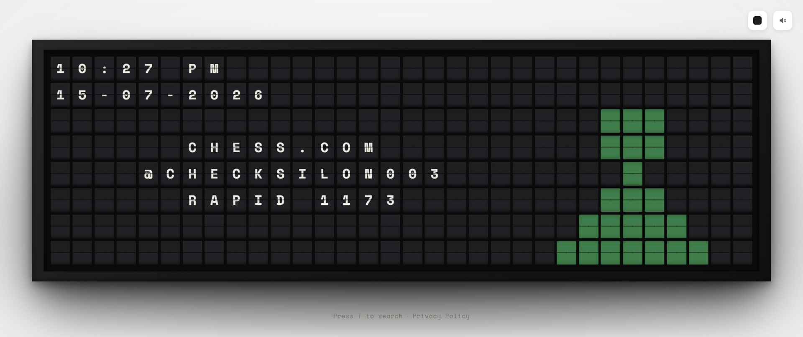

# Split Flap Display — v7

A split-flap mechanical display for your new tab, inspired by Vestaboard.
MV3 Chrome extension, no backend, no accounts.

## What changed in this pass

- **Weather icon widened further** — 6x6 → 9x6, bolder/fuller shapes.
  Vertical space was already maxed at 6 rows (everything below the
  permanent clock/date), so "bigger" now comes from width and boldness.
- **Four new stat modules**, all off by default, all needing the user's
  own username/API key: **GitHub** (public REST API, no auth), **Chess.com**
  (public stats API, no auth), **WakaTime** (personal API key), **Steam**
  (personal API key + Steam ID). Chosen because none of them need OAuth or
  an app-review process — see the platform research from last round.
- **User-controlled module order.** `enabledModules` in Settings is now the
  literal rotation order — Settings has up/down arrows per module instead
  of a fixed sequence.
- **Time-on-sites tracker**, shown right after the greeting by default.
  Tracks active-tab hostnames locally via a new background service-worker
  listener (`tabs.onActivated`/`onUpdated`, `windows.onFocusChanged`, plus
  a 1-minute `alarms` checkpoint so long sessions and service-worker
  restarts don't lose data). Top 5 sites by time today, resets naturally at
  midnight since storage is date-keyed. **Off by default** — this is the
  most privacy-sensitive thing in the extension, so it requires a separate,
  explicit consent toggle in Settings, distinct from just being in the
  rotation list. Data never leaves the device and auto-prunes after 3 days.
- **"Press T to search" hint**, small and subtle, below the board — only
  shown when search mode is actually enabled.
- Fixed a real bug while building the tracker: the generic text-centering
  helper (`useBoard.setLines`) didn't know rows 0–1 are permanently
  reserved for the clock/date overlay, so a tall enough module (like the
  6-line tracker) would have silently collided with it. Now reserved
  properly for every module that uses it.

## New permissions (this is the significant one to flag)

Adding the tracker and the four new API integrations changed the
permission surface substantially:
- `tabs` — required for the time-on-sites feature to read the active tab's
  hostname. Inert unless that feature is explicitly enabled.
- `alarms` — periodic checkpointing/pruning for the same feature.
- `host_permissions` for api.open-meteo.com, api.github.com,
  api.chess.com, wakatime.com, api.steampowered.com — lets the extension
  page fetch these directly regardless of each API's own CORS policy
  (Steam's API in particular doesn't set CORS headers at all, so this is
  required for that one to work from a browser context rather than just a
  defensive addition).

This is no longer the minimal-permission extension it started as — see the
privacy policy for the full accounting, and the Store Listing draft for
per-permission justification text for the Web Store dashboard.

## Web Store submission — what's now done

- [x] Privacy policy drafted (`PRIVACY_POLICY.md`) — covers what's
  collected (nothing, server-side), what's local-only, and an explicit
  section on India's DPDP Act 2023 alongside the more standard GDPR/CCPA-
  style disclosures Google's dashboard expects
- [x] Single-purpose statement, store summary, full description, category
  recommendation, and per-permission justification text (`STORE_LISTING.md`)
- [x] Promotional tile image, 440×280 (`promo_tile_440x280.png`)

**Still blocked** — genuinely need your input or a real browser:
- [ ] A place to host the privacy policy publicly (GitHub Pages on your
  existing account is the natural option — flagged in `STORE_LISTING.md`)
- [ ] A real contact email to replace the placeholder in the policy
- [ ] Actual screenshots from a loaded instance (1280×800 or 640×400) — I
  still can't produce these without a live Chrome instance
- [ ] Developer account registration ($5 one-time fee)
- [ ] Actually loading and testing this in real Chrome — everything in
  this project has been verified structurally, never visually, for seven
  rounds now

## Load it

```
npm install
npm run build
```

`chrome://extensions` → Developer mode → Load unpacked → select `dist/`.

## Current modules (default order)

1. **Greeting** — time-of-day or holiday-aware
2. **Time on sites** — off by default, needs opt-in
3. **Weather** — auto-located, Celsius by default, with a condition icon

Off by default, addable via Settings: GitHub, Chess.com, WakaTime, Steam.
Search mode (press `T`) is a separate toggle, not part of the rotation.
